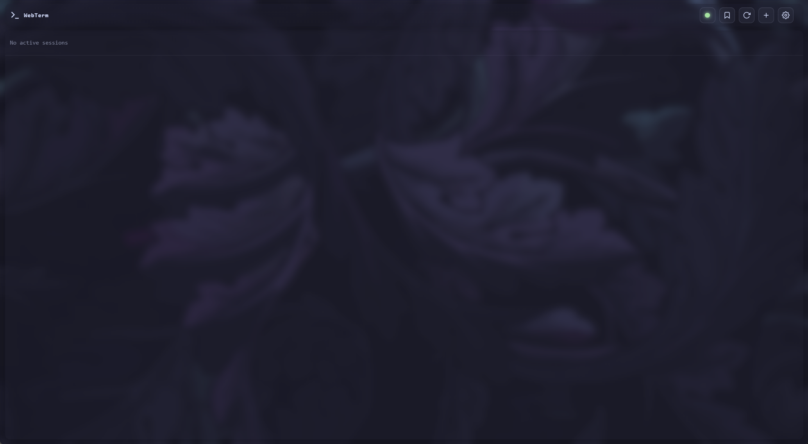
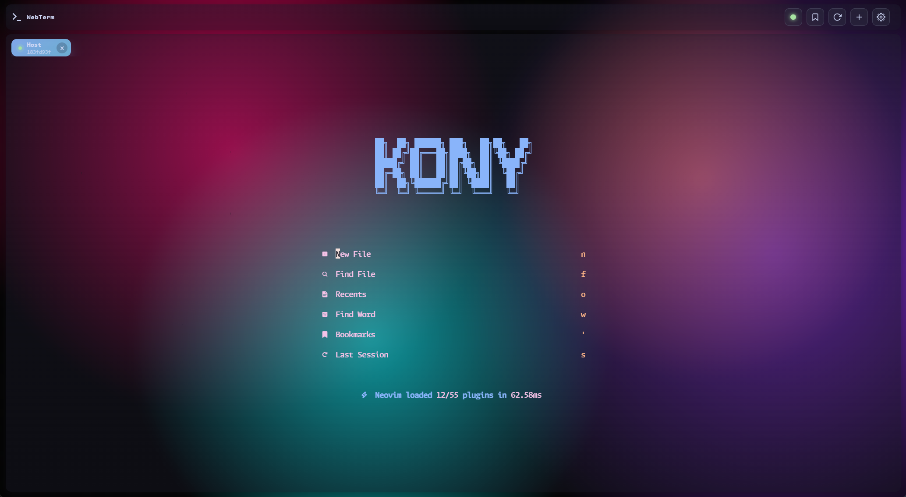
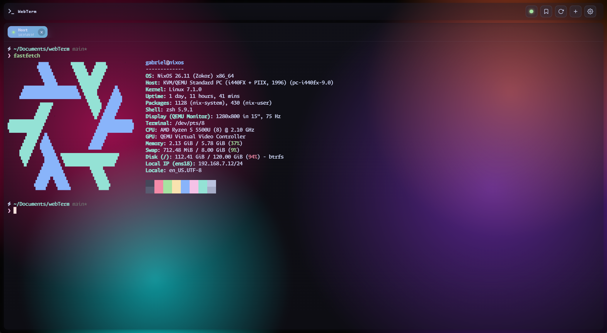

<div align="center">

# WebTerm

**A self-hosted, browser-based terminal for SSH & Telnet.**

Connect to remote servers from any modern browser — no client installs, no plugins.

**English** · [简体中文](README_zh.md)

[](#license)
[](https://go.dev/)
[](https://www.docker.com/)
[](https://xtermjs.org/)

</div>

## ✨ Features

- **SSH & Telnet** — password, private key, or key + passphrase authentication.
- **Multi-session tabs** — many terminals side by side in one browser window.
- **Connection manager** — reusable profiles with credentials encrypted at rest.
- **OSC 52 clipboard** — copy from remote `tmux` / `nvim` straight into the browser clipboard.
- **Themes & backgrounds** — bundled themes (e.g. *Catppuccin Mocha*), custom backgrounds, frosted-glass UI.
- **Real authentication** — bcrypt passwords, HMAC-signed cookies, auth-gated WebSocket.
- **Tiny footprint** — single static Go binary (~13 MB idle RSS), ~17 MB scratch-based image, embedded SQLite.

## 📸 Screenshots

<p align="center">
  
  
  
  
</p>

<details>
<summary><b>🔌 Connection manager</b></summary>
<br>

</details>

<details>
<summary><b>⚙️ Settings & theme switcher</b></summary>
<br>

</details>

## 🚀 Quick Start

Docker is the only supported deployment method.

```bash
# 1. Configure — SESSION_SECRET is required
cp .env.example .env   # then edit: set SESSION_SECRET and a strong ADMIN_PASS

# 2. Run
docker compose up -d
```

Open **http://localhost:8008** and log in with `admin` / `admin` (or your
`ADMIN_USER` / `ADMIN_PASS`). **Change the password immediately** after first login.

All state persists in `./data/` (SQLite database and uploaded backgrounds),
bind-mounted into the container — backups are just a folder copy.

## ⚙️ Configuration

Everything is configured via `.env` or environment variables:

| Variable | Default | Description |
|----------|---------|-------------|
| `PORT` | `8008` | Host port (compose maps `${PORT}:8008`) |
| `SESSION_SECRET` | — | **Required.** Signs session cookies — use a long random value |
| `ADMIN_USER` | `admin` | Default admin username (created only when the users table is empty) |
| `ADMIN_PASS` | `admin` | Default admin password — **change in production** |
| `LOG_LEVEL` | `warn` | `debug` \| `info` \| `warn` \| `error` |
| `GOMEMLIMIT` | `200MiB` | Soft memory cap for the Go runtime |

## 🏗️ Architecture


The Go binary embeds the entire frontend (`embed.FS`) and serves HTTP + WebSocket.
Upstream it dials SSH (`x/crypto/ssh`) or Telnet (a hand-written IAC state machine).
State lives in pure-Go SQLite (no CGO).

**Tech stack:** xterm.js (canvas renderer) · Go `net/http` + [`coder/websocket`](https://github.com/coder/websocket) · [`x/crypto/ssh`](https://pkg.go.dev/golang.org/x/crypto/ssh) · [`modernc.org/sqlite`](https://pkg.go.dev/modernc.org/sqlite) · bcrypt + HMAC-SHA256 cookies

## 📡 API

<details>
<summary><b>REST & WebSocket reference</b></summary>
<br>

All endpoints return JSON. Authenticated endpoints require the `connect.sid` cookie
from `POST /api/auth/login`.

| Method | Path | Auth | Description |
|--------|------|------|-------------|
| `POST` | `/api/auth/login` | — | Body: `{username, password}`. Sets the session cookie. |
| `POST` | `/api/auth/logout` | — | Destroys the current session. |
| `POST` | `/api/auth/change-password` | ✓ | Body: `{currentPassword, newPassword}` (≥6 chars). |
| `GET` | `/api/connections` | ✓ | List saved connection profiles. |
| `POST` | `/api/connections` | ✓ | Create a profile (`name`, `protocol`, `host`, `port`, `username` required). |
| `PUT` | `/api/connections/{id}` | ✓ | Update a profile. |
| `DELETE` | `/api/connections/{id}` | ✓ | Delete a profile. |
| `GET` | `/api/sessions` | ✓ | List historical sessions. |
| `GET` | `/api/settings` | — | Get UI settings. |
| `PUT` | `/api/settings` | ✓ | Persist UI settings. |
| `GET` | `/api/backgrounds` | ✓ | List uploaded backgrounds. |
| `POST` | `/api/backgrounds/upload` | ✓ | Multipart upload (`image` field; JPEG/PNG/GIF/WebP, ≤ 5 MB). |
| `DELETE` | `/api/backgrounds/{id}` | ✓ | Delete a background. |

**WebSocket** — upgrade on `/`; a valid `connect.sid` cookie is required (else `401`).
All frames are JSON text:

| Client → server | Purpose |
|-----------------|---------|
| `create` | Open a session: `protocol`, `host`, `port`, `username`, `password`, `cols`, `rows` |
| `input` | Keystrokes: `sessionId`, `data` |
| `resize` | Viewport change: `sessionId`, `cols`, `rows` |
| `close` | Tear down: `sessionId` |

| Server → client | Purpose |
|-----------------|---------|
| `created` | Ack: `sessionId`, `protocol` |
| `output` | Upstream output: `sessionId`, `data` |
| `exit` | Upstream ended: `sessionId` |
| `error` | `message` (and optional `sessionId`) |

</details>

## 🔒 Security

- **bcrypt** (cost 10) password hashing.
- **HMAC-SHA256**-signed session cookies — HttpOnly, SameSite=Lax, `Secure` auto-applied behind TLS.
- **Auth-gated WebSocket** — unauthenticated clients cannot open terminals.
- **Filename sanitation** on uploads; **path-traversal rejection** on file downloads.
- SSH host-key verification is **off** (matches the original `ssh2` default) — harden it in `go-server/ssh.go` for production.

**Before deploying:** set a strong `SESSION_SECRET` and `ADMIN_PASS`, change the
default password after first login, and serve WebTerm behind TLS.

## 🛣️ Roadmap

- [ ] Strict SSH host-key verification (configurable `known_hosts`)
- [ ] Passphrase-encrypted SSH keys at rest
- [ ] Cluster mode (Redis-backed sessions)
- [ ] Split panes

## 🤝 Contributing

PRs welcome — the codebase is ~2,000 LOC of Go plus a no-build-step vanilla-JS frontend.

```bash
cd go-server
go test ./... && go vet ./...
```

## 📄 License

Released under the **MIT License**. See [LICENSE](LICENSE) for details.
