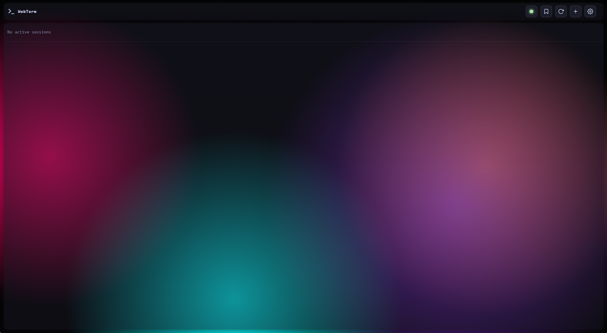
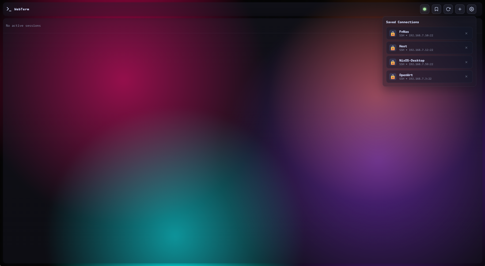
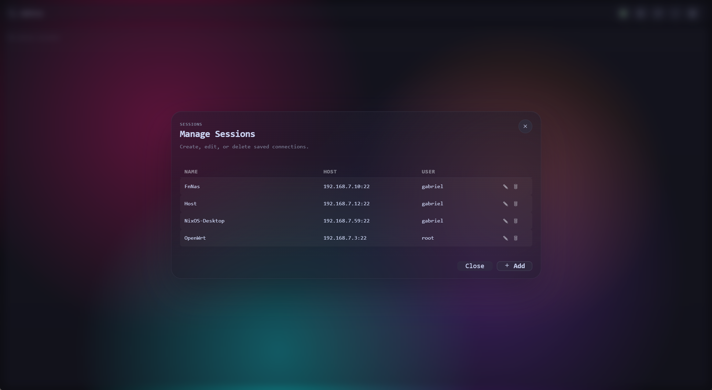
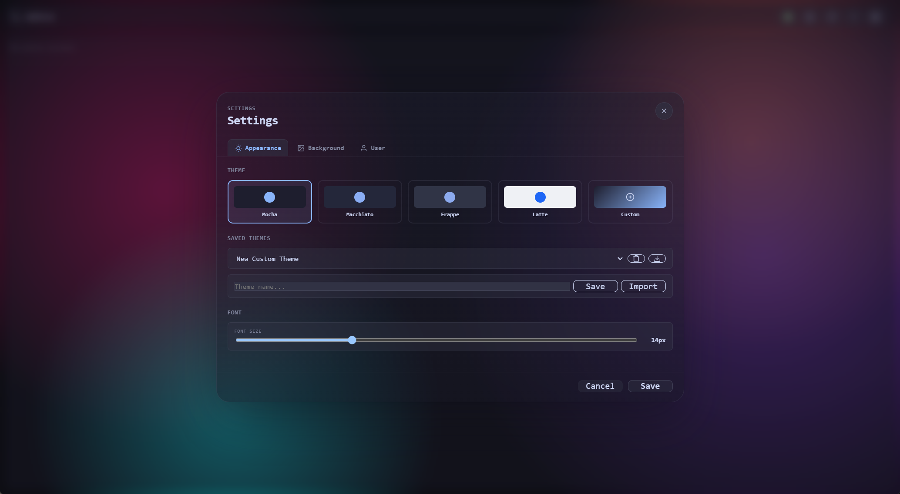
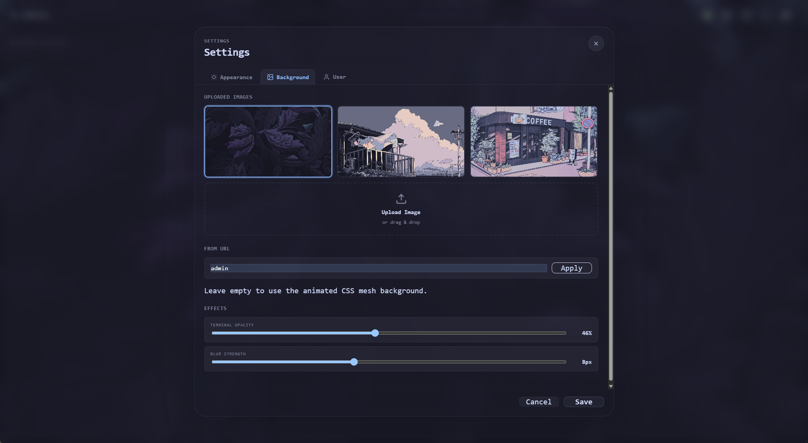
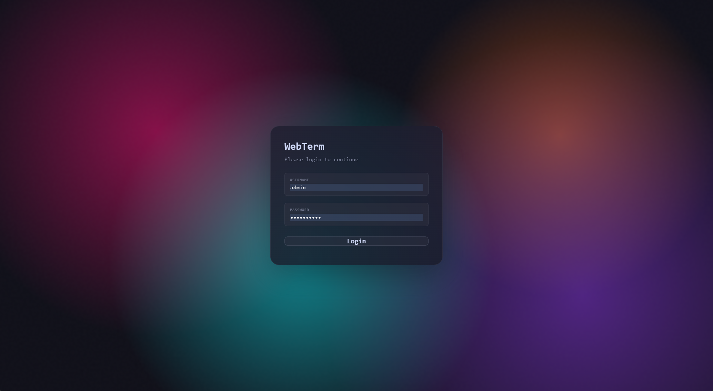

<div align="center">

# WebTerm

**A self-hosted, browser-based terminal for SSH & Telnet.**

Connect to remote servers from any modern browser — no client installs, no plugins.
Built on [xterm.js](https://xtermjs.org/) with a real-time WebSocket backend, encrypted credential
storage, session recording, and a polished frosted-glass UI.

[](#license)
[](https://www.typescriptlang.org/)
[](https://nodejs.org/)
[](https://xtermjs.org/)
[](#features)
[](#contributing)

</div>

---

## Overview

WebTerm turns a web browser into a fully-featured terminal gateway. Spin it up on a
server, log in once, and you can open multiple SSH or Telnet sessions in browser tabs,
save connection profiles, record sessions for audit or playback, and copy text straight
out of remote `tmux`/`nvim` — all behind a single authenticated endpoint.

> Ideal for homelabs, jump-hosts, ops dashboards, or anywhere you want a terminal
> without installing one.

---

## ✨ Features

- **SSH & Telnet** — Connect to remote hosts with password, key, or key + passphrase authentication.
- **Multi-session tabs** — Run many terminals side by side in a single browser window.
- **Connection Manager** — Save and organize reusable connection profiles with credentials encrypted at rest.
- **Session Recording** — Capture every session in [asciinema](https://asciinema.org/) `.cast` format for replay and audit.
- **OSC 52 Clipboard** — Copy from remote `tmux`, `nvim`, and friends directly into your browser clipboard.
- **Theming & Backgrounds** — Switch themes (e.g. *Catppuccin Mocha*), set custom backgrounds, and tune transparency with a frosted-glass UI.
- **Authentication** — Session-based login with `bcrypt`-hashed passwords and a default admin you can change.
- **Self-contained** — SQLite-backed, zero external databases required. Optional [Nix](https://nixos.org/) shell included.

---

## 📸 Screenshots

> ℹ️ Images are collapsible — click a title to expand. _(Screenshots are being added; paths are reserved under `docs/images/`.)_

<details>
<summary><b>🖥️ Main terminal interface</b></summary>
<br>



<p><em>The primary workspace — frosted-glass topbar with status indicator, session tab bar, and a translucent terminal viewport rendering over a custom background.</em></p>

</details>

<details>
<summary><b>🗂️ Multiple sessions & tabs</b></summary>
<br>



<p><em>Several SSH and Telnet sessions running concurrently, each with a live connection-status indicator and recording toggle on its tab.</em></p>

</details>

<details>
<summary><b>🧭 Connection Manager</b></summary>
<br>



<p><em>Save, edit, and reuse connection profiles. Credentials are encrypted at rest and never exposed to the browser after a session is opened.</em></p>

</details>

<details>
<summary><b>🎬 Session recording (asciinema)</b></summary>
<br>


<p><em>Record any session to a standard <code>.cast</code> file, then download or replay it later for review, debugging, or compliance.</em></p>

</details>

<details>
<summary><b>🎨 Themes & appearance settings</b></summary>
<br>



<p><em>Pick a theme (Default, Catppuccin Mocha, …), adjust transparency, and switch fonts from a single tabbed settings panel.</em></p>

</details>

<details>
<summary><b>🖼️ Custom backgrounds & transparency</b></summary>
<br>



<p><em>Choose built-in presets (Forest / Mountain / Ocean) or upload your own, then dial in blur and opacity for a glassy, see-through terminal.</em></p>

</details>

<details>
<summary><b>📋 OSC 52 clipboard in action</b></summary>
<br>


<p><em>Remote programs (<code>nvim</code>, <code>tmux</code>, …) push text to your local clipboard over OSC 52 — no add-ons required. See <a href="docs/osc52-clipboard.md">OSC 52 docs</a>.</em></p>

</details>

<details>
<summary><b>🔐 Login screen</b></summary>
<br>



<p><em>A single gated login protects every session. Change the default <code>admin</code> / <code>admin</code> credentials before exposing the service.</em></p>

</details>

---

## 🧱 Tech Stack

| Layer | Technology | Purpose |
|-------|------------|---------|
| Frontend | [xterm.js](https://xtermjs.org/) (Canvas renderer) + vanilla JS | Terminal rendering & UI |
| Backend | [Express](https://expressjs.com/) + [ws](https://github.com/websockets/ws) | HTTP API + real-time WebSocket |
| Protocols | [ssh2](https://github.com/mscdex/ssh2), [telnet-client](https://github.com/mkozjak/node-telnet-client) | SSH & Telnet clients |
| Storage | [better-sqlite3](https://github.com/WiseLibs/better-sqlite3) | Connections, users, metadata |
| Auth | [bcrypt](https://github.com/kelektiv/node.bcrypt.js) + [express-session](https://github.com/expressjs/session) | Password hashing & sessions |
| Language | [TypeScript](https://www.typescriptlang.org/) | End-to-end type safety |
| Recordings | asciinema `.cast` (filesystem) | Portable session replays |

---

## 🚀 Quick Start

### Prerequisites

- **Node.js ≥ 18**
- A C++ toolchain and Python (for compiling native modules like `bcrypt` and `better-sqlite3`)

<details>
<summary><b>Using Nix? (recommended on NixOS)</b></summary>

```bash
nix-shell   # provides nodejs, gcc, python3, pkg-config, …
```

</details>

### Install & Run

```bash
# 1. Install dependencies (also copies xterm assets into public/lib)
npm install

# 2. Configure (optional — sane defaults are built in)
cp .env.example .env
#   …then edit .env, or just set env vars inline

# 3. Run in development
npm run dev

#   …or build & run in production
npm run build
npm start
```

The server starts at **`http://localhost:3000`** (override with `PORT`).

Log in with the default credentials, then **change them immediately**:

```bash
ADMIN_USER=admin ADMIN_PASS=admin npm start
```

---

## ⚙️ Configuration

All settings are optional and have sensible defaults. Configure via a `.env` file or environment variables:

| Variable | Default | Description |
|----------|---------|-------------|
| `PORT` | `3000` | Port the HTTP/WebSocket server listens on |
| `HOST` | `0.0.0.0` | Network interface to bind |
| `SESSION_SECRET` | `webterm-secret-change-in-production` | Secret used to sign session cookies — **set this in production** |
| `DB_PATH` | `./data/webterm.db` | SQLite database file location |
| `LOG_DIR` | `./data/logs` | Directory for session recordings (`.cast`) |
| `ADMIN_USER` | `admin` | Default admin username |
| `ADMIN_PASS` | `admin` | Default admin password |

---

## 🧭 Usage

1. Open the app in your browser and log in.
2. Click **New Session** to connect, or pick a saved profile from the **Connection Manager**.
3. Authenticate with a password, private key, or key + passphrase.
4. Work in the terminal as usual — resize, open more tabs, start/stop a recording.
5. Review recorded sessions anytime under **Recordings** (downloadable as `.cast`).

---

## 🏗️ Architecture

```
┌─────────────────────────────────────────────────────────────────┐
│                    Browser  (xterm.js, Canvas)                    │
│   Terminal viewport · Session tabs · Connection manager · Settings│
└───────────────────────────────┬───────────────────────────────────┘
                                 │  HTTP API  +  WebSocket
┌───────────────────────────────┴───────────────────────────────────┐
│                       Express Server                              │
│   Auth middleware · Session manager · Protocol handlers · Recorder│
└──────────┬────────────────────────────────────┬──────────────────┘
           │                                    │
           ▼                                    ▼
┌─────────────────────┐               ┌──────────────────────────┐
│        SSH          │               │         Telnet           │
│     (ssh2)          │               │   (telnet-client)        │
└─────────────────────┘               └──────────────────────────┘
           │                                    │
           ▼                                    ▼
┌──────────────────────────────────────────────────────────────────┐
│                         Storage Layer                             │
│   SQLite (connections · users · metadata)   │   Filesystem (.cast)│
└──────────────────────────────────────────────────────────────────┘
```

### Project Structure

```
webTerm/
├── src/
│   ├── server.ts              # Express + WebSocket server
│   ├── config.ts              # Configuration
│   ├── middleware/            # Auth & session middleware
│   ├── routes/                # REST API & WebSocket handlers
│   ├── services/              # Session manager & connection store
│   ├── protocols/             # SSH & Telnet implementations
│   ├── models/                # Connection / session / user types
│   └── utils/                 # Logger & crypto utilities
├── public/
│   ├── index.html             # App shell
│   ├── css/term.css           # Design system
│   ├── js/                    # Frontend application logic
│   ├── themes/                # Theme definitions (JSON)
│   └── backgrounds/           # Built-in preset backgrounds
├── docs/                      # Documentation & design specs
└── data/                      # SQLite DB & session recordings (runtime)
```

---

## 📡 API Reference

<details>
<summary><b>REST endpoints</b></summary>

All endpoints except `auth/login` require an authenticated session.

| Method | Path | Description |
|--------|------|-------------|
| `POST` | `/api/auth/login` | Authenticate and start a session |
| `POST` | `/api/auth/logout` | End the session |
| `POST` | `/api/auth/change-password` | Change the admin password |
| `GET` | `/api/connections` | List saved connections |
| `POST` | `/api/connections` | Create a connection |
| `PUT` | `/api/connections/:id` | Update a connection |
| `DELETE` | `/api/connections/:id` | Delete a connection |
| `GET` | `/api/sessions` | List active sessions |
| `GET` | `/api/settings` | Read app settings |
| `PUT` | `/api/settings` | Update app settings |
| `GET` | `/api/recordings` | List recordings |
| `GET` | `/api/recordings/:id/download` | Download a `.cast` recording |

</details>

<details>
<summary><b>WebSocket protocol</b></summary>

**Client → Server**

```jsonc
{ "type": "create", "protocol": "ssh", "host": "192.168.1.10", "port": 22 }
{ "type": "input",  "sessionId": "...", "data": "ls -la\n" }
{ "type": "resize", "sessionId": "...", "cols": 80, "rows": 24 }
{ "type": "close",  "sessionId": "..." }
```

**Server → Client**

```jsonc
{ "type": "created", "sessionId": "...", "protocol": "ssh" }
{ "type": "output",  "sessionId": "...", "data": "file1 file2\n" }
{ "type": "exit",    "sessionId": "..." }
{ "type": "error",   "sessionId": "...", "message": "Connection refused" }
{ "type": "recording:status", "sessionId": "...", "active": true }
```

</details>

---

## 🔒 Security

- **Encrypted credentials** — Stored connection passwords are encrypted at rest, not stored in plaintext.
- **Hashed passwords** — User/admin passwords are hashed with `bcrypt`.
- **Session auth** — A signed session cookie gates every API and WebSocket request.
- **Change defaults** — Replace the default `admin` / `admin` credentials and set a strong `SESSION_SECRET` before exposing the service publicly.

> WebTerm is intended to run on a trusted network or behind a reverse proxy with TLS. Always serve it over HTTPS in production.

---

## 🛣️ Roadmap

- [ ] User accounts & role-based access
- [ ] In-app recording playback
- [ ] SFTP file transfer
- [ ] Key generation & management UI
- [ ] Additional themes

---

## 🤝 Contributing

Contributions are welcome! Please open an issue first to discuss what you'd like to change, then submit a pull request.

```bash
git checkout -b feature/your-feature
# make your changes…
npm run build   # ensure it compiles
```

---

## 📄 License

Released under the **MIT License**. See [LICENSE](LICENSE) for details.

## Go 版本（低内存）

后端已用 Go 重写（`go-server/`），功能与 Node 版一致，内存占用降低 70-80%（空闲 ~15-25MB）。

### 本地运行

```bash
cd go-server
go build -o webterm .
cd .. && ./go-server/webterm   # 复用根目录 .env 与 data/
```

### Docker（推荐）

```bash
docker build -t webterm .
docker compose up -d     # 端口取 .env 的 PORT，默认 8008
```

镜像 ~15MB（scratch + 静态二进制）。数据持久化在 `./data`（SQLite、背景图、日志）。
